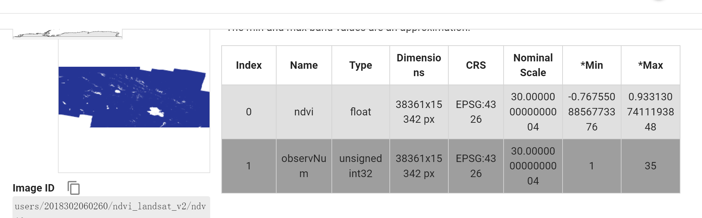
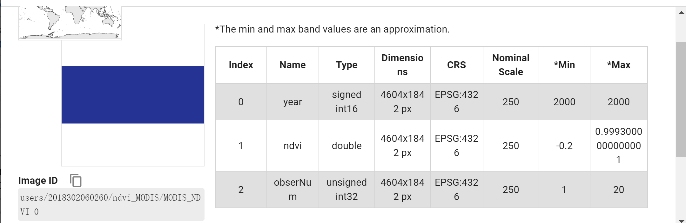
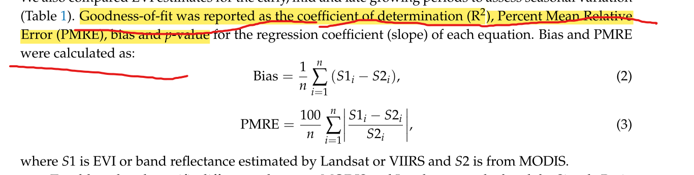

# 项目任务

## 数据获取与预处理
***
### Landsat数据预处理
***
#### 数据筛选
筛选各代Landsat数据的时间范围如下：
* landsat 5 (2000-01-01,2012-05-05)
* landsat 7 (2000-01-01,2022-12-31)
* landsat 8 (2013-03-18,2022-12-31)

空间范围：祁连山
#### QA处理
QA波段含义

```javascript
Bit 0: 填充 (Fill)。这个比特用于表示该像元在图像中不存在或被遮挡，比如云或阴影。
Bit 1: 膨胀的云 (Dilated Cloud)。这个比特用于表示该像元周围存在云的可能性。
Bit 2: 卷云（高置信度）(Cirrus (high confidence))。这个比特用于表示该像元周围存在卷云，并且可信度高。
Bit 3: 云 (Cloud)。这个比特用于表示该像元为云。
Bit 4: 云阴影 (Cloud Shadow)。这个比特用于表示该像元被云阴影覆盖。
Bit 5: 雪 (Snow)。这个比特用于表示该像元为雪覆盖。
Bit 6: 清晰 (Clear)。如果为1，则说明该像素可以使用，如果为0，则说明该像素包含云或者阴影等干扰，需要排除掉。
Bit 7: 水 (Water)。这个比特用于表示该像元为水体。
Bits 8-9: 云可信度 (Cloud Confidence)。这两个比特用于表示云的可信度，共分为四个等级：无、低、中、高。
Bits 10-11: 云阴影可信度 (Cloud Shadow Confidence)。这两个比特用于表示云阴影的可信度，共分为四个等级：无、低、中、高。
Bits 12-13: 雪/冰可信度 (Snow/Ice Confidence)。这两个比特用于表示雪/冰的可信度，共分为四个等级：无、低、中、高。
Bits 14-15: 卷云可信度 (Cirrus Confidence)。这两个比特用于表示卷云的可信度，共分为四个等级：无、低、中、高。
```

处理前


处理后

***

####重命名波段和应用尺度因子

Landsat8 和754 用于计算NDVI的波段不同。

* Landsat8：'SR_B5','SR_B4','SR_B3'
* Landsat7：'SR_B4','SR_B3','SR_B2'

统一重命名为：'nir','red','green'

Landsat8 7 5 4 的定标参数都相同
乘以尺度因子(0.0000275)再加(-0.2)

并给每张影像添加‘year’属性
***
#### 计算NDVI
分别对L5、L7、L8集合中的每张影像计算NDVI。并将Landsat5 和 Landsat8 的NDVI使用转换函数调整到Landsat7 的水平。同时，记得保存'year'属性
***
####按照年份分类


* 给每张影像添加‘year’属性(前面已做)
* 定义一个数据集**yearsCol**，其中的每个image是值等于所在年度的常数图像。具有属性‘year’。
* 将L7Col 和 L8Col 合并为mergedCol
* 使用ee.Join.saveAll函数，根据year属性将mergedCol中的图像分类到yearsCol中每一年图像的属性**images**下。


***
####计算年最大值NDVI和年有效观测数

对yearCol 进行一个map循环，取出存在属性**images**下的每一年的数据，计算

* 每一年的有效观测数
* 该年所有影像的NDVI合成的年最大值NDVI

对于部分区域，其年观测值竟然达到了60+个，按道理来说，Landsat8的回归周期16天，一年应该也就23个左右的观测。

查过资料以后，应该是条带重复的问题。每次过境由于条带重复，在重复区的位置多了很多观测值。包括前后重叠和左右重叠。

**Landsat 8的轨道宽度为185千米（115英里），这意味着它在每次通过时都会覆盖一个宽度为185千米的区域。由于地球是圆形的，所以Landsat 8的轨道会有所重叠，这种重叠（或侧重叠）从赤道处的7%变化到极端纬度处的最大值约85%。因此，在两次观测之间，即使时间间隔不足16天，也可能在不同的条带上观测到同一观测点。**

***

#### 将年最大值NDVI数据导出到Asset中

***

###MODIS数据预处理
####QA处理
Bitmask for SummaryQA

Bits 0-1: VI quality (MODLAND QA Bits)

* 0: Good data, use with confidence
* 1: Marginal data, useful but look at detailed QA for more information
* 2: Pixel covered with snow/ice
* 3: Pixel is cloudy

在detailQA中
Bits 11-13: Land/water mask 0: 浅海（shallow ocean） 1: 陆地 2: 海岸线和湖泊岸线 3: 浅水区

**排除掉SummaryQA波段中等于2且等于3的像元，并去除掉detailQA中水体的部分**
***

####按照年份分类

* 给每张影像设置‘year’属性
* 使用saveAll函数将同一年的影像归类到一起，存在该年的'same_year'属性下

####计算年最大值NDVI和年有效观测数

* 先获取NDVI波段，再计算年最大值NDVI，记得乘以尺度因子0.0001
* 计算年有效观测数
  ####将年最大值NDVI数据导出到Asset中

导出过程和Landsat类似

**注意：导出到Asset的MODIS年最大值NDVI数据和Landsat的有个区别，Landsat的是两个波段：ndvi和observNum；MODIS的是三个波段：ndvi，year，observNum
**

landsat 年最大值ndvi 2000年


MODIS 年最大值ndvi 2000年

***


###高程数据预处理

高程数据：**NASA SRTM Digital Elevation 30m**

elevation_max: 5799
elevation_min: 1743
elevation_mean: 3652.723947965866

**处理过程：**

* 划定不同的高程范围
* 按照高程范围划分研究区。将在一定高程范围内的像元设置为1，其他为masked。这样划分出多个研究区mask。使用的时候只需要
  整个研究区数据.updateMask(子研究区)
* 子研究区Mask导出到Asset
  ###注
  **为了更好地去除云、雪地、阴影等，在利用QA波段去除后，再设置一个最小观测数阈值。当总观测数少于这个观测数时，mask掉该像元。**

**或者不去掉，直接计算回归斜率，同时计算P值。利用P值去除显著性差的数据**
***
##计算数学指标

###整个研究区

#### NDVI均值

计算两个数据集每年的NDVI均值，并画图表示NDVI均值随时间的变化曲线。

画出均值的散点图，X-Landsat，Y-MODIS，最小二乘拟合曲线。计算决定系数R²，百分比平均相对误差PMRE，偏差Bias，P值。



#### Slope均值与相关系数

先生成两个数据集的泰尔森回归图，再计算整个研究区内Slope的均值。对比这两种均值。

逐像元计算研究区范围内两种数据集的Slope的相关系数

#### 年平均相关系数

每年逐像元计算相关系数。如对于2000年，计算该年的MODIS和Landsat像元级相关系数。

每年的数据都有后，计算年平均相关系数。


#### 绿化/褐化面积

1. 因为分辨率不同，先计算出某个数据集的绿化或褐化像元个数，再乘以单个像元的面积。

2. 分别计算绿化/褐化面积占总面积的比例
3. 将Slope划分为不同的等级，生成各种等级类型图。
   
4. 计算显著性绿化/显著性褐化像元面积
    * 显著性绿化：Slope值大于某阈值
    * 显著性褐化：Slope值低于某阈值

#### 一致性绿化/褐化像元，不一致性像元所占比例

先将Landsat 重采样到250m，再上生成一致性绿化、一致性褐化，L绿M褐，L褐M绿，图。并计算以上各类型的百分比。

* 一致性绿化像元：MODIS和Landsat都是绿化的像元
* 一致性褐化像元：同理

***
###NDVI和Slope随着高程的变化模式及差异

植被量随着高程的变化，应该呈现出某种变化趋势。
如下图，在天山地区和青藏高原都表现出了不同的NDVI随高程的变化模式和Slope随高程的变化模式。


对于MODIS和Landsat来说，它们也应该各自反映了一种变化模式。用一下的数学指标来衡量两种趋势的差异。


对于00-22年的数据，每一年的MODIS和Landsat应该都会反应两种变化趋势。我们用以上的数学指标描述该年份两种数据集反映趋势的差异性。然后制作该数学指标随年份的变化，以及该数学指标的标准差。


###按照高程划分子研究区

按照高程划分成不同的子研究区，对于每个子研究区，采用和整个研究区类似的研究方法。

计算两种数据集在不同高程范围内的相关性，RMSE，Bias等数据。

可以得出结论一下结论：MODIS和Landsat在哪个高程范围内的相关性最高。最后，阅读文献，寻找原因。

研究区的划分和相关指标的计算类似下图。


对于每个子研究区，需要计算以下数据：

* 每年的NDVI均值(00-22)
* Slope
* MODSI和Landsat在研究区内的回归方程
* 决定系数R²
* PMRE，Bias

需要画出以下的图：

* 均值的散点图
  X-Landsat，Y-MODIS。
* 最小二乘拟合直线
* MODIS和Lansat在子研究区内的均值变化趋势图

